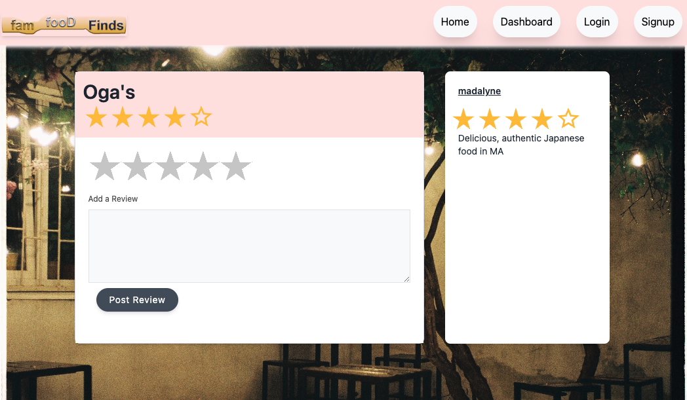
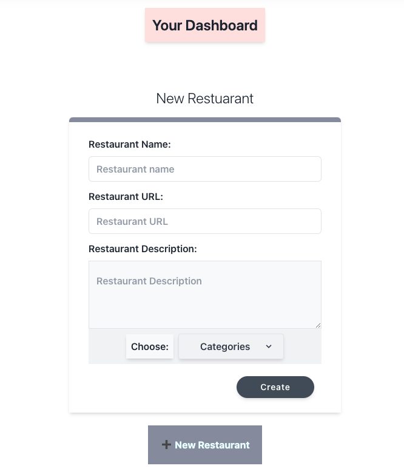

# fam-food-finds

## Description

Tired of sifting through thousands of reviews to find somewhere good to eat?
Picked a restaurant based on reviews and been horribly disappointed?
Enter My Food Finds, a small app for just family and friends to share restaurant recommendations from people you know to people you know.

## Table of Contents
* [Installation](#installation)
* [Usage](#usage)
* [Built With](#built-with)
* [Collaborators](#collaborators)

## Installation
~~~
npm i
~~~
## Usage

Open the app on heroku here: 
  

## Built With
* Node.js
* Express.js, express-sessions
* Handlebars
* Sequelize
* MySQL2 
* Bcrypt and dotenv
* TailwindCSS

